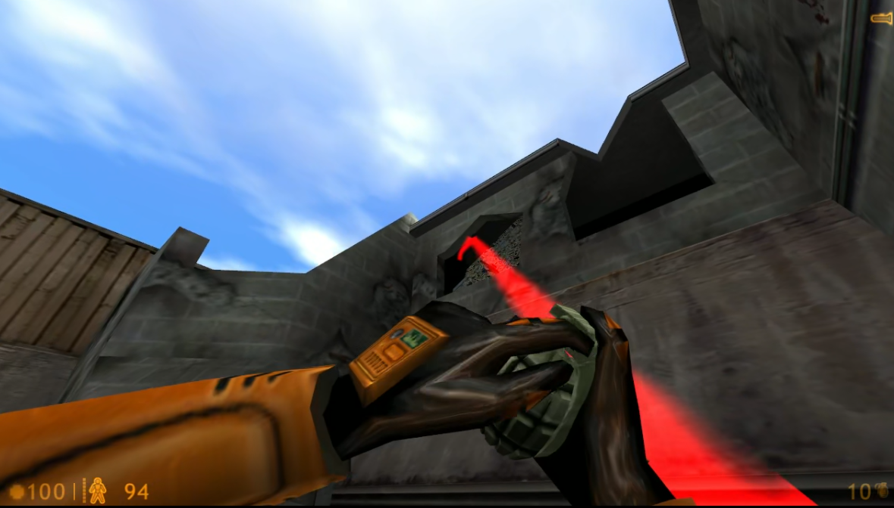

# Grenade Toss Trajectory Mod

Modern games have these to help you to sling the grenade to your target without missing.

However, earlier games such as Half-Life 1 does not have all these luxuries. Mastering grenade tosses is a tough sport!

Here I'm demonstrating how to add this simple grenade toss trajectory into the game.

[](hl_grenade_toss_path.mp4)

## Limitations
- There's no "quadratic function" beams there - I have to construct the arc with small short straight beams. Hmm, it looks pretty ***janky, low-res and retro***, feels like I'm playing this on an old AMD K6-2 desktop. *Note: I have no plans to beautify this arc! I specifically wants it to feel like the 2000!* :D
- It doesn't predict grenade bounce paths yet.
- The tossing path only works at view angles of 0 degrees to -90 degrees (looking upwards). It doesn't draw the path if you toss the thing downwards.
- It's *really* janky and inaccurate. I had to add console printouts at the grenade code to see the relationship between the throwing angles, the maximum height the grenade goes, and the maximum distance the grenade lands.
- From the previous point... I estimated these values and fit them *manually* into functions, and *desperately* fit them some more using the Desmos graphing site. Here are the formulas:
    - Maximum distance:
    ```
    -0.8x2 + 81x + 650 ( 0 < -x < 57.3 )
	1/(0.0002x-0.0111) ( 57.3 < -x < 90 )
    ```
    - Maximum height:
    ```
    y = 520erf(0.038x - 1.2) + 520
    ```
- Yes, there's an Error Response Function being used inside. That could be **computationally expensive**! If that's an AMD K6-2 (or something older) I think it could drop some framerates! I'm finding an alternative for this one.
- It doesn't factor in the player's velocity. The toss will drift from the projected path if you are running while tossing. For now to have a more accurate toss - stand still before slinging.
- Roll the grenade? That could be a next thing to do too! :D