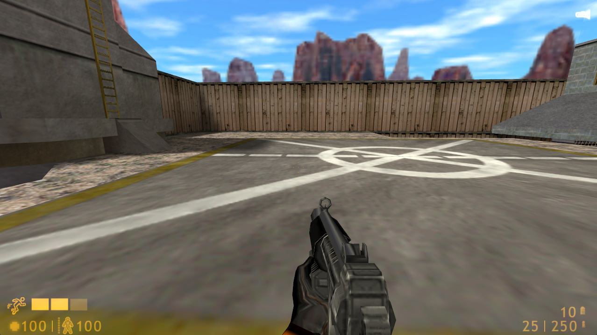

# Sprint function

After playing Half-Life 2 when I was younger, why not I tried putting that sprint function back into the Half-Life 1? Could be an exciting idea too! :D

# Instructions
At the `additional_files` folder, copy these files into the `sprites` folder in your Half-Life mod.

Server side: `sv_maxspeed 533.33` must be given before testing the sprint, or else the speed doesn't change!

# How to generate sprites
For this "sprinting man icon" I got it from [Flaticon](https://www.flaticon.com/free-icons/running-man).

[Inkscape](https://inkscape.org/) can be used to downsize the image into at least 128x128 (or whatever fits the HUD). Make sure the **transparent color is black**! Save it as PNG file if you are done with it!

[HL Texture Tools](https://github.com/yuraj11/HL-Texture-Tools) needed to convert that PNG file to SPR file for use in the Half-Life.

Simple instructions to generate SPR file for HUD using the HL Texture Tools :
- Go to `Tools`->`Create New Sprite`
- Click `Add Images`
- Go `Settings` tab, then at "Texture Format", select `Additive`.
- At the "Image Color Palette", select `Transparent Color Replacement` to **black**.
- Then click on the `Save Sprite` tab!

# Additional notes
The changes are moderately complicated - basically you need to modify the `input.cpp`, `player.cpp`, `UserMessages.cpp`, `hud.cpp` and add `stamina.cpp` to allow the function inside.

Register of the messages there at `UserMessages.cpp` is required and keep track of the number, or else you'll get the "bogus calls" error!

*Note*: This does not also fully imitate the Half-Life 2's stamina recharging. In HL2, when the stamina's (suit power) out and holding shift, it'll *still recharge*! This one is inspired by newer games that forces player to walk when stamina's run out and shift key is still engaged.

## Future improvements
It has only 3 bars, because I'm trying to test if this works or not at the first place! Putting 5 bars and a sleeker design would work better!